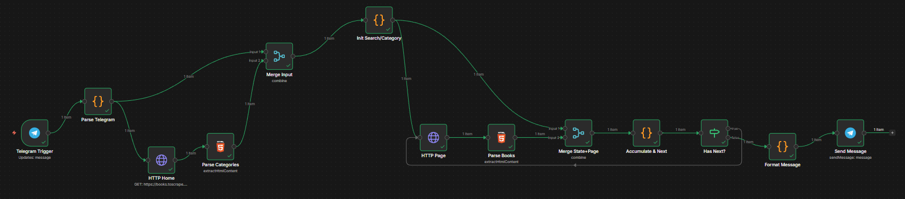

# Automatización de Web Scraping de Libros con n8n

Este proyecto implementa un sistema automatizado de web scraping que extrae información de libros desde el sitio de práctica:

https://books.toscrape.com/

El sistema está construido utilizando workflows en n8n y se integra con un bot de Telegram que permite a los usuarios realizar búsquedas y recibir los resultados directamente en el chat.

---

# Objetivo del Proyecto

El objetivo de este proyecto es desarrollar un flujo de automatización capaz de:

- Extraer información estructurada desde páginas web.
- Procesar y transformar datos HTML.
- Automatizar consultas de usuarios mediante un bot.
- Integrar múltiples servicios dentro de un flujo automatizado.

Este proyecto forma parte de un portafolio enfocado en automatización, scraping web e integración de APIs.

---

# Tecnologías Utilizadas

- n8n – Automatización de workflows
- Telegram Bot API – Interacción con usuarios
- HTTP Requests – Obtención de contenido web
- HTML Parsing – Extracción de información
- Web Scraping – Recolección de datos públicos

---

# Arquitectura del Sistema

El sistema sigue el siguiente flujo de automatización:

Usuario → Bot de Telegram → Workflow en n8n → Solicitud HTTP a la página → Procesamiento HTML → Respuesta al usuario

---

# Flujo de Funcionamiento

1. El usuario envía una palabra clave al bot de Telegram.
2. El bot activa un Telegram Trigger en n8n.
3. El workflow procesa la búsqueda solicitada.
4. Se realiza una petición HTTP al sitio books.toscrape.com.
5. Se extrae la información de los libros desde el HTML.
6. Los resultados se formatean y se envían al usuario en Telegram.

---

# Información Extraída

El sistema obtiene los siguientes datos de cada libro:

- Título del libro
- Precio
- Rating
- Enlace directo al libro

---

# Ejemplo de Resultado en Telegram

Cuando el usuario realiza una búsqueda, el bot devuelve una lista de libros encontrados.

Ejemplo:

Buscaste: "a"  
Top 10 resultados

1. A Light in the Attic  
Precio: £51.77  
https://books.toscrape.com/catalogue/a-light-in-the-attic_1000/index.html  

2. Sharp Objects  
Precio: £47.82  
https://books.toscrape.com/catalogue/sharp-objects_997/index.html  

3. Sapiens: A Brief History of Humankind  
Precio: £54.23  
https://books.toscrape.com/catalogue/sapiens-a-brief-history-of-humankind_996/index.html  

---

# Workflow de Automatización

El siguiente diagrama muestra el flujo implementado en n8n.

